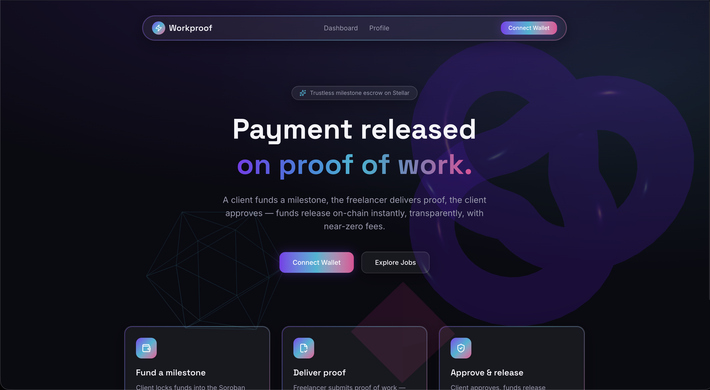
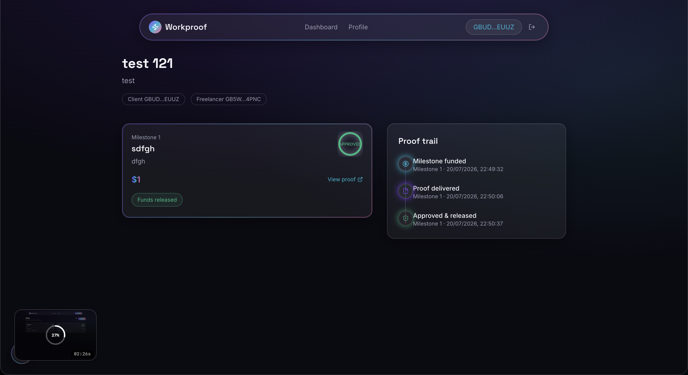
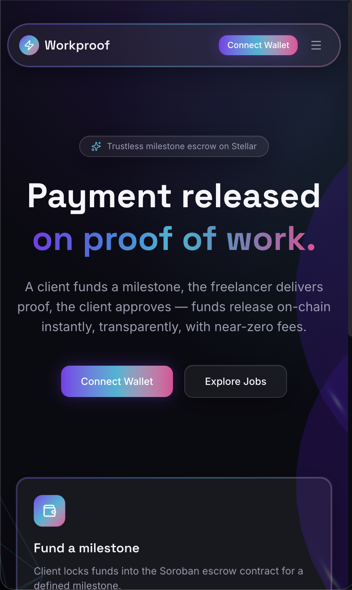
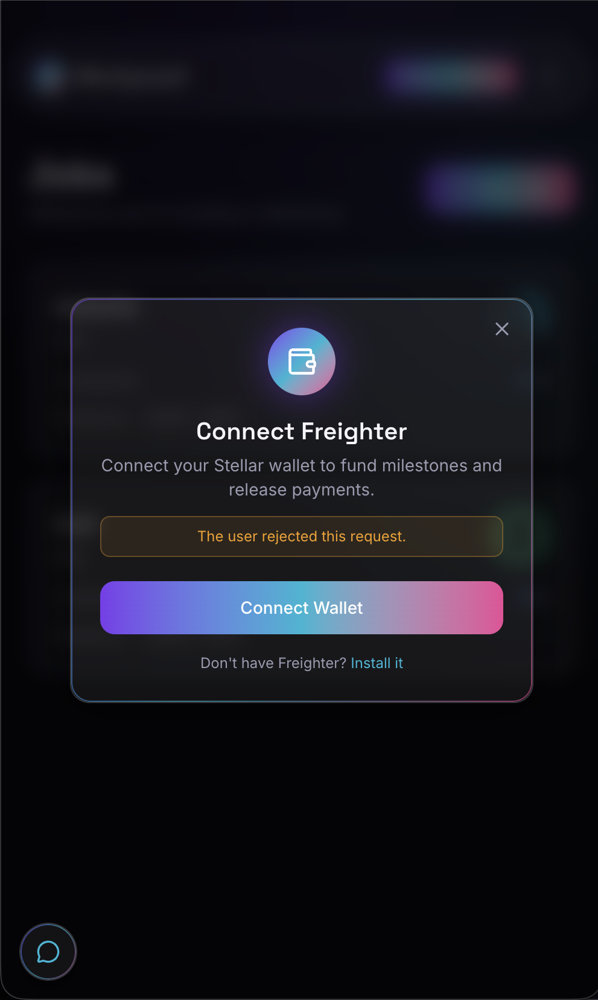
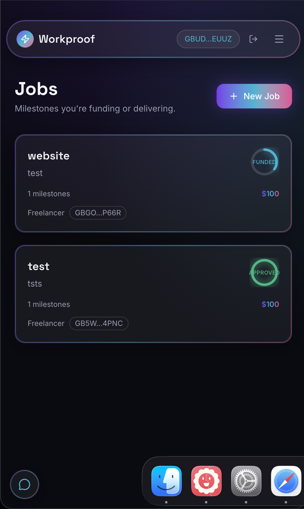
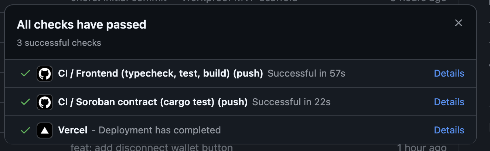
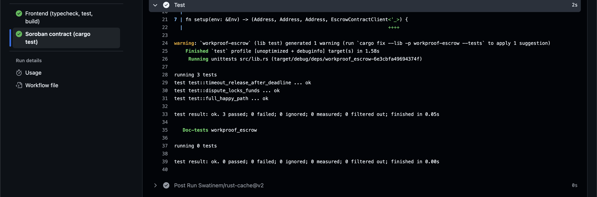
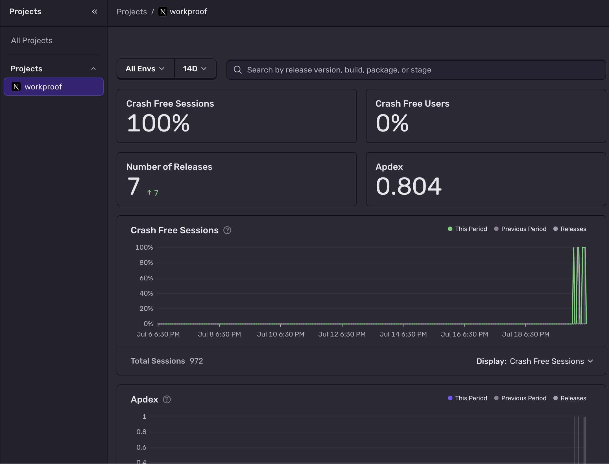
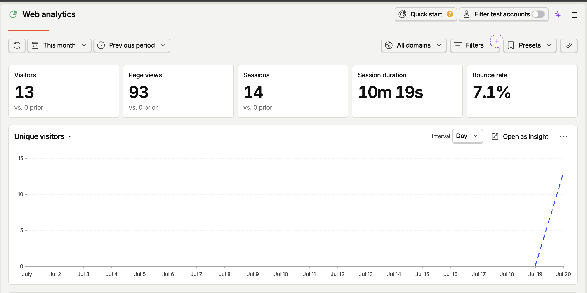
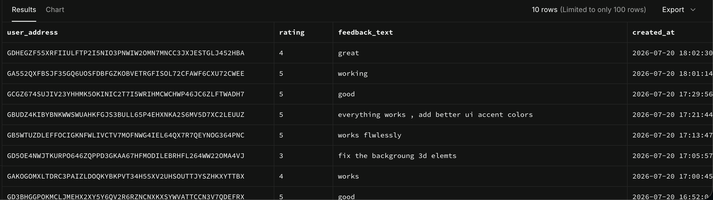

<div align="center">

# ⚡ Workproof

**Trustless milestone escrow for freelancers and clients, powered by Soroban on Stellar.**

A client funds a milestone, the freelancer delivers proof of work, the client approves — funds release on-chain instantly, transparently, with near-zero fees.

[](https://github.com/protonv11/workproof/actions/workflows/ci.yml)
[](https://workproof-two.vercel.app/)
[](https://stellar.expert/explorer/testnet/contract/CDKDKYTQOV2HJ4HFAVLCYH4Y37PQGPY576UVYYEPEHSSCTNEAYJVSSKX)
[](https://nextjs.org)
[](contract)
[](#)

**[🚀 Live App](https://workproof-two.vercel.app/) · [📜 Contract on Stellar Expert](https://stellar.expert/explorer/testnet/contract/CDKDKYTQOV2HJ4HFAVLCYH4Y37PQGPY576UVYYEPEHSSCTNEAYJVSSKX) · [🎬 Demo](#screenshots)**

</div>

---

## Live deployment

| | |
|---|---|
| **App URL** | [workproof-two.vercel.app](https://workproof-two.vercel.app/) |
| **Contract (Stellar testnet)** | [`CDKDKYTQOV2HJ4HFAVLCYH4Y37PQGPY576UVYYEPEHSSCTNEAYJVSSKX`](https://stellar.expert/explorer/testnet/contract/CDKDKYTQOV2HJ4HFAVLCYH4Y37PQGPY576UVYYEPEHSSCTNEAYJVSSKX) |
| **Repository** | [github.com/protonv11/workproof](https://github.com/protonv11/workproof) |

---

## Architecture

```
┌─────────────────────────┐        ┌──────────────────────────┐
│   Next.js frontend       │        │  Soroban escrow contract  │
│   (App Router, TS)       │◄──────►│  (Rust, contract/)        │
│   Freighter wallet conn. │  RPC   │  deployed on testnet      │
└───────────┬──────────────┘        └──────────────────────────┘
            │
            ├─► Supabase — off-chain job/milestone metadata,
            │              proof links, user_feedback
            ├─► Sentry — client/server/edge error monitoring
            └─► PostHog — pageviews + custom event analytics
```

On-chain state (funds, milestone status) is always read from the Soroban contract — Supabase only stores descriptions, proof links, and feedback. If Supabase/Sentry/PostHog env vars are unset, the app falls back to mock data / no-ops rather than crashing, so it's explorable without a backend.

## Tech stack

- **Frontend:** Next.js 16 (App Router), TypeScript, Tailwind CSS v4
- **Animation:** Framer Motion, React Three Fiber + drei (3D hero background)
- **Wallet:** Freighter (`@stellar/freighter-api`)
- **Chain SDK:** `@stellar/stellar-sdk` (Soroban RPC + generated contract bindings)
- **Smart contract:** Rust + Soroban SDK
- **Off-chain DB:** Supabase (Postgres)
- **State/data fetching:** TanStack Query
- **Error monitoring:** Sentry (`@sentry/nextjs`)
- **Product analytics:** PostHog (`posthog-js`)
- **Testing/CI:** Vitest + React Testing Library, GitHub Actions

## Project structure

```
app/                 Next.js App Router pages (/, /dashboard, /dashboard/new, /job/[jobId], /profile)
components/          UI kit (glass/gradient/motion primitives) + feature components
lib/                 Wallet, contract client, Supabase client, analytics, hooks, types
contract/            Soroban escrow contract (Rust) — see contract/README.md for build/deploy
supabase/migrations/ SQL migrations
screenshots/         Product/mobile/CI screenshots + demo gif (this README)
```

## Setup

```bash
npm install
cp .env.example .env.local   # fill in the values below
npm run dev
```

### Environment variables

See [`.env.example`](.env.example) for the full list. All are validated at build time (missing optional ones — Sentry/PostHog/Supabase — degrade gracefully instead of crashing; the escrow contract ID is required for real on-chain calls).

| Variable | Required | Purpose |
|---|---|---|
| `NEXT_PUBLIC_ESCROW_CONTRACT_ID` | yes | Deployed Soroban contract address |
| `NEXT_PUBLIC_SOROBAN_RPC_URL` | yes | Soroban RPC endpoint (defaults to testnet) |
| `NEXT_PUBLIC_SUPABASE_URL` / `NEXT_PUBLIC_SUPABASE_ANON_KEY` | optional | Off-chain metadata + feedback; falls back to mock data if unset |
| `NEXT_PUBLIC_SENTRY_DSN` | optional | Error monitoring; no-op if unset |
| `NEXT_PUBLIC_POSTHOG_KEY` / `NEXT_PUBLIC_POSTHOG_HOST` | optional | Analytics; no-op with a dev-mode console warning if unset |

### Smart contract

Build/test/redeploy it yourself — see [`contract/README.md`](contract/README.md).

## Level 4 Production Telemetry & Feedback Architecture

### Error Monitoring — Sentry

Sentry is wired via `@sentry/nextjs` across all three runtimes (`instrumentation-client.ts` for the browser, `sentry.server.config.ts` and `sentry.edge.config.ts` for the server, loaded through `instrumentation.ts`). Every config is gated on `NEXT_PUBLIC_SENTRY_DSN` — if it's unset, Sentry never initializes and the app runs normally with a single dev-mode console warning.

Two React error boundaries wrap the app: [`app/global-error.tsx`](app/global-error.tsx) catches root-layout-level crashes, and [`app/error.tsx`](app/error.tsx) catches page-level errors while keeping the navbar/shell intact. Both report to Sentry via `captureException` and render a glassmorphic "Try again" card instead of a blank screen.

Beyond the boundaries, every wallet and contract call site captures explicitly with structured context:
- **Wallet connect** ([`lib/wallet-context.tsx`](lib/wallet-context.tsx)) — tags the failure as `flow: wallet_connect` (rejected signature, wallet not found, network mismatch all surface here).
- **Contract calls** ([`lib/contract.ts`](lib/contract.ts)) — every Soroban call is wrapped with an RPC-level breadcrumb (`withBreadcrumb`) so simulation/signing/submission failures are traceable even before the caller's own tags land. Call sites in [`app/job/[jobId]/page.tsx`](app/job/[jobId]/page.tsx) and [`app/dashboard/new/page.tsx`](app/dashboard/new/page.tsx) add job ID, milestone index, and the attempted action as `extra` context.

Users never see the raw error — every failure path also shows a human-readable glass toast (see below) while the full exception ships to Sentry for debugging.

### Product Analytics — PostHog

[`components/PostHogProvider.tsx`](components/PostHogProvider.tsx) wraps the app (mounted in `app/providers.tsx`), initializes `posthog-js` client-side, and tracks pageviews automatically on every route change (App Router `pathname`/`searchParams`, wrapped in `Suspense` per Next.js requirements).

Custom events fire at the exact moments a user takes a meaningful action, defined in [`lib/analytics.ts`](lib/analytics.ts):

| Event | Fires when | Captures |
|---|---|---|
| `wallet_connected` | Freighter connects successfully | truncated address, wallet type |
| `job_created` | Client submits the job wizard | milestone count, total XLM locked (computed from real form values) |
| `milestone_funded` | Client funds a milestone | job ID, milestone index, amount |
| `milestone_delivered` | Freelancer submits proof | job ID, milestone index |
| `milestone_approved` | Client approves (or timeout-claims) | job ID, milestone index |
| `milestone_disputed` | Client disputes | job ID, milestone index |

If `NEXT_PUBLIC_POSTHOG_KEY` is unset, `initAnalytics()` short-circuits with a dev-mode console warning and every `analytics.*` call becomes a no-op — no crashes, no silent data loss expectation.

### User Feedback — Supabase

A floating glass button (bottom-left, matches the app's corner-anchored FAB pattern) opens a glassmorphic modal ([`components/FeedbackWidget.tsx`](components/FeedbackWidget.tsx)) with a 5-star rating selector (glows cyan on selection) and a frosted textarea. Submission goes through a TanStack Query mutation ([`useSubmitFeedback`](lib/hooks.ts)) to the `user_feedback` table:

```sql
user_feedback(
  id uuid primary key default gen_random_uuid(),
  user_address text,           -- nullable, populated from connected wallet if present
  rating int check (1-5),
  feedback_text text,
  created_at timestamptz default now()
)
```

Migration: [`supabase/migrations/001_user_feedback.sql`](supabase/migrations/001_user_feedback.sql). Row-level security is enabled with an insert-only policy — clients can submit feedback but never read others' submissions.

On success, the modal shows a spring-physics particle-burst confirmation. On failure, a glass toast shows a human-readable error and the exception is reported to Sentry.

## Screenshots

### Desktop

| Landing | Job detail — live proof trail |
|---|---|
|  |  |

### Mobile (375–428px)

| Landing | Wallet connect | Dashboard |
|---|---|---|
|  |  |  |

### CI / monitoring

| All checks passing (frontend + contract + Vercel) | Contract test run (`cargo test`) |
|---|---|
|  |  |

### Analytics, error monitoring & feedback (live data)

| Sentry — error monitoring | PostHog — analytics | Supabase — user feedback |
|---|---|---|
|  |  |  |

10 real feedback submissions from distinct wallet addresses, 11+ distinct wallets total have interacted with the app (connected wallet, submitted feedback, or called the contract on testnet).

### Demo


## Submission checklist

- [x] 10+ real users connected wallets and completed at least one testnet action
- [x] Real feedback collected via the in-app flow
- [x] Screenshots: desktop UI, mobile views, CI/monitoring setup
- [x] Demo video (GIF): connect → create job → fund → deliver → approve → funds released
- [x] Live app URL
- [x] 15+ meaningful commits (see `git log`)
